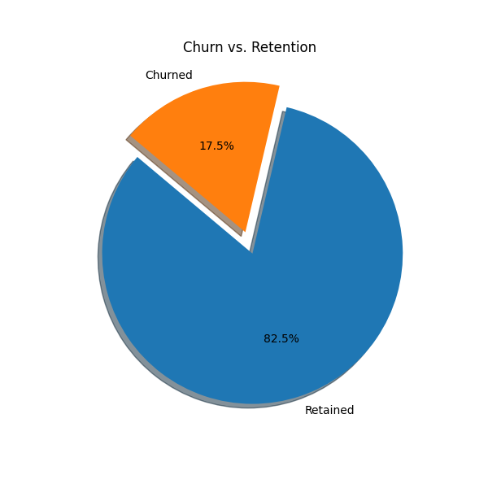
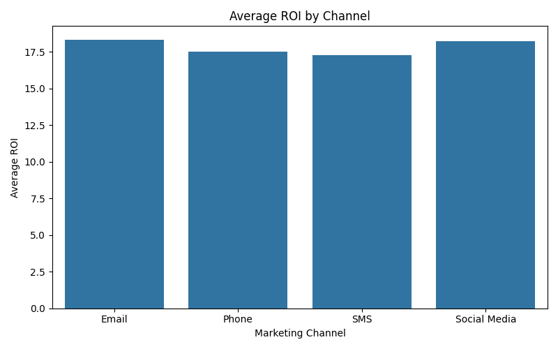
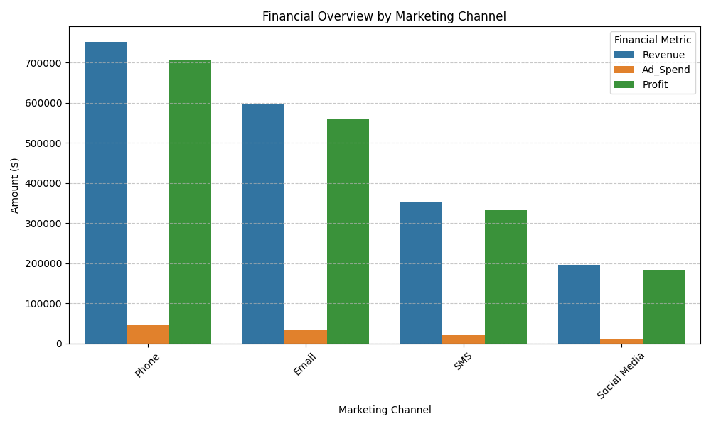
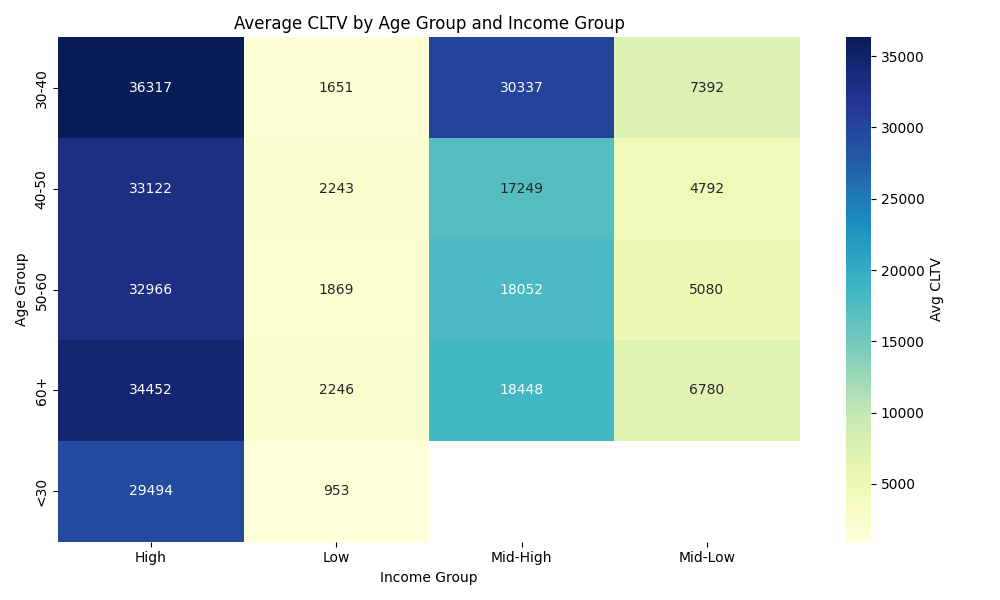
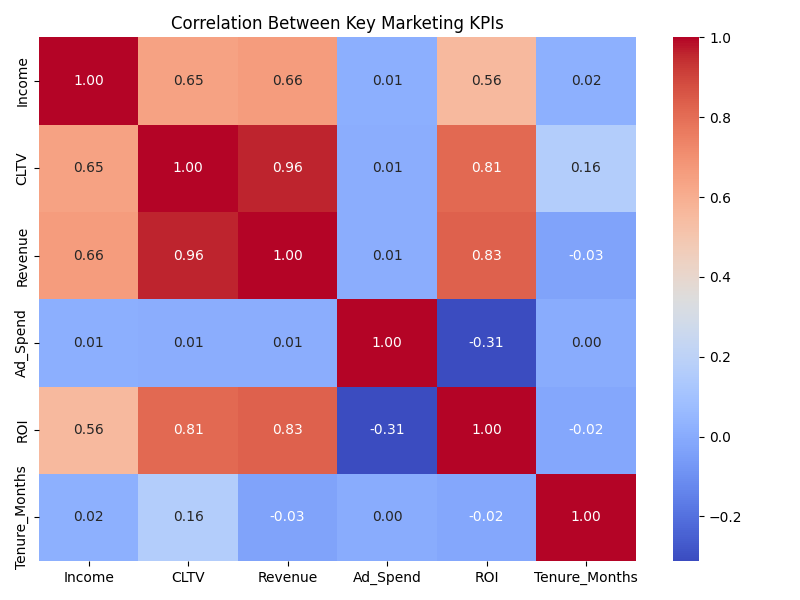

# Marketing Return On Investment (ROI) & Customer Value Analysis

This project dives into a marketing dataset to uncover insights around campaign effectiveness, customer value and marketing spend efficiency. The goal was to answer real business questions like:

- Which channels generate the most profit relative to ad spend?
- How valuable are our customers over time?
- What’s our current churn rate, and how can we reduce it?
- Are we spending smartly across marketing platforms?
- Is there a pattern between income levels and customer lifetime value?

I treated this like a real-world marketing case study — not just a data cleaning task, but an end-to-end business analytics solution.

---

## Why This Project?

Most marketing datasets shared online stop at exploratory analysis. I went further — adding simulated business context, computing actual KPIs, and structuring everything in a way that mimics how data teams work in real companies.

Whether you're looking to optimize campaigns, reduce churn, or better understand customer value, this project shows how data can drive real impact.

---

## 🔍 Project Objective

Marketing teams often struggle to quantify campaign effectiveness and customer value in a way that leads to actionable strategy. This project helps simulate that scenario by:

- Calculating core marketing KPIs like **CLTV**, **ROI**, **CAC**, and **Churn**
- Segmenting customers by channel, income, and behavior
- Visualizing patterns that can inform smarter decision-making

---

## 🛠️ Tools & Technologies

| Purpose               | Tools / Libraries                |
|-----------------------|----------------------------------|
| Language              | Python 3                         |
| Data handling         | pandas                           |
| Visualization         | seaborn, matplotlib              |
| Environment           | Visual Studio Code               |
| Version control       | Git + GitHub                     |

---

## Project Structure

```bash
Marketing_analysis_roi/
├── data/
│   ├── marketing_raw.csv              # Original dataset
│   └── marketing_enhanced.csv         # With calculated fields like ROI, CLTV
├── notebooks/
│   └── marketing_analysis.ipynb       # Full step-by-step analysis notebook
├── scripts/
│   ├── metrics.py                     # Marketing KPIs logic script
│   └── visualizations.py              # Visualizations script
├── visuals/ 
│   ├── churn_vs_retention_pie.png
│   ├── roi_by_channel.png
│   ├── adspend_vs_revenue_scatter.png
│   ├── channel_financials_comparison.png
│   └── income_vs_cltv.png
├── requirements.txt
└── README.md
```
---

## Metrics Calculated

| Metric                | Explanation                       |
|-----------------------|----------------------------------|
| CAC                   | Customer Acquisition Cost = Ad Spend / Conversions                         |
| CLTV                  | Customer Lifetime Value = Revenue × Tenure               |
| ROI                   | (Revenue - Ad Spend) / Ad Spend                          |
| Churn Rate            | % of customers who left in the last period               |
| Profit by Channel     | Net gain per channel = Revenue - Ad Spend                |

---

## Visual Insights

Here are some of the insights I explored using visualizations:

- ### Churn vs Retention


- ### Average ROI by Channel (Email & Phone were top performers)


- ### Financial Comparison between channels


- ### Customer Lifetime Value (CLTV) distribution by Income and Age Group


- ### Heatmap of correlation between calculated KPIs


---

## What This Project Demonstrates

🧠 Business-focused analytics: not just code, but insights
🧱 Clean project structure with reusable Python scripts
📊 Data storytelling with readable, impactful visuals
🔍 Analytical thinking applied to a real-world problem

---

## 📌 Dataset

Original Source: [Kaggle - Customer Personality Analysis](https://www.kaggle.com/datasets/imakash3011/customer-personality-analysis?resource=download)

Enhanced version includes:
- Simulated marketing spend
- Channel info
- Revenue per customer
- Churn labels for analysis and other metrics

---

## 🙋🏻‍♂️ About Me

Hi, I’m **Darshan — currently pursuing a Master’s in Data Science** in Berlin. I'm passionate about solving real-world problems with data and love building end-to-end solutions like this.

Feel free to connect on [LinkedIn](https://www.linkedin.com/in/darshanr-c) or explore more of my work on [GitHub](https://github.com/darshanr-c).
